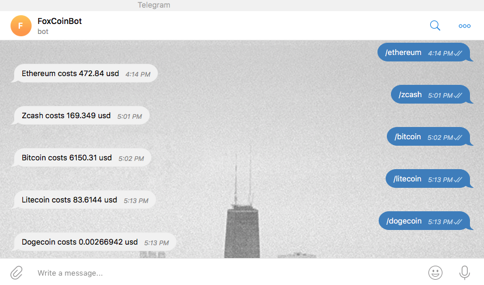

# Crypto currency telegram bot
>Basic telegram bot powered by a webhook that helps you get latest USD exchange rates for all types of crypto currencies.
>
> Bot is called `FoxCoinBot` that served by [pythonanywhere.com](https://pythonanywhere.com) hosting, search for it in the telegram to allow it help you to get your desired coin. Enjoy it!

**Tools**
> - python3.6 
> - flask
> - pytest
> - pythonanywhere hosting

## Usage
Run script from the root directory of the project:
```bash
~ python coin_bot.py
```

## Demo



## Run tests
Run `pytest` from shell in the root directory of the repository to run `unittests`. 
It uses [pytest.ini](pytest.ini) config file as a setup.

## Developments notes

## Release notes

* 0.1.0
    * First distribution of an app

### Meta
Author – Volodymyr Yahello vyahello@gmail.com

Distributed under the `MIT` license. See [LICENSE](LICENSE.md) for more information.

You can reach out me at:
* [https://github.com/vyahello](https://github.com/vyahello)
* [https://www.linkedin.com/in/volodymyr-yahello-821746127](https://www.linkedin.com/in/volodymyr-yahello-821746127)

### Contributing

1. clone the repository
2. configure Git for the first time after cloning with your `name` and `email`
3. `python3.6` is required to run the code
4. run `pip install -r requirements.txt` to install all required python packages
5. run `pip install -r requirements-dev.txt` to install all required python packages
